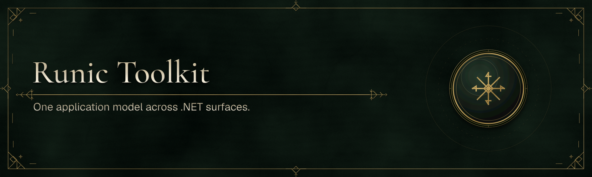

# Runic Toolkit Examples

This repository preserves the filtered history of the examples extracted from
WebUIToolkit and now consumes the independently released Runic Artifex packages.
Every sample is standalone from the product source repositories: .NET projects
restore exact NuGet versions, browser projects restore exact npm versions, and
the package-only canaries under [`integrations/`](integrations/) guard each
product boundary.

## Package authentication

Runic packages are private during the migration. Local restores need a GitHub
personal access token with `read:packages` exposed to NuGet without committing it:

```bash
export NuGetPackageSourceCredentials_github="Username=YOUR_GITHUB_USER;Password=YOUR_TOKEN;ValidAuthenticationTypes=Basic"
dotnet restore integrations/RunicTranslations.Canary/RunicTranslations.Canary.csproj
dotnet restore integrations/RunicCommandLine.Canary/RunicCommandLine.Canary.csproj
dotnet restore integrations/RunicFlow.Canary/RunicFlow.Canary.csproj
dotnet restore integrations/RunicAssets.Canary/RunicAssets.Canary.csproj
```

The Setup frontend uses GitHub's npm registry through the committed `.npmrc`:

```bash
export NODE_AUTH_TOKEN="YOUR_TOKEN"
npm ci
```

After both package managers are authenticated, the full package-only check is:

```bash
dotnet restore samples/03-SetupApplication/SetupApplication.csproj
npm run verify
dotnet build samples/03-SetupApplication/SetupApplication.csproj --configuration Release
dotnet run --project samples/03-SetupApplication/SetupApplication.csproj -- --smoke-test
```

GitHub Actions uses its repository `GITHUB_TOKEN` with `packages: read`. Each
private NuGet or npm package must grant this repository Actions access before its
workflow can restore it.

The neutral Setup wizard is the reference application boundary. It uses named
commands, an Effect-owned frontend runtime, generated C# dispatch from committed
schemas, opaque host-owned destination selections, and explicit operations.
The React sample consumes the controller directly. The SvelteKit sample uses the
official Svelte-5-only rune lifecycle, static/native SvelteKit adapter, Runic
Vite plugin, and official Vite DevTools extension point. Both drive the same
native contract and backend handler.

## License

Runic Toolkit Examples is licensed under the [MIT License](LICENSE). Third-party
components retain their own licenses and attribution terms.
